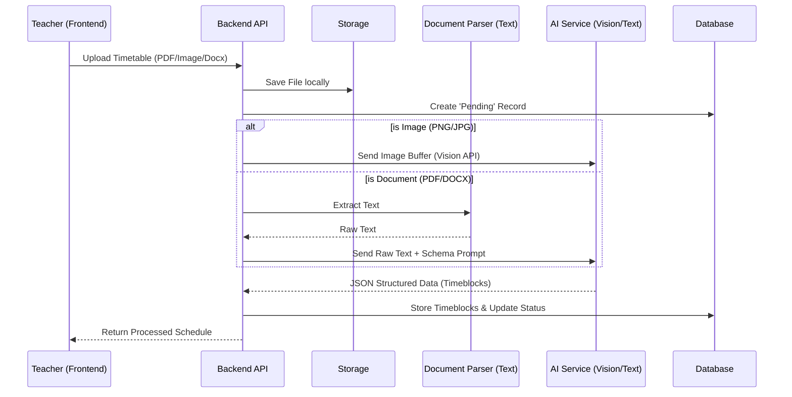

# System Architecture - Learning Yogi Timetable System

## 1. Architectural Design Plan

### End-to-End Workflow

The system follows a linear pipeline optimized for flexibility and accuracy.

### Technology Stack & Rationale

| Component       | Choice                                     | Rationale                                                                                                                                                 |
| --------------- | ------------------------------------------ | --------------------------------------------------------------------------------------------------------------------------------------------------------- |
| **Backend**     | Node.js + Express                          | Non-blocking I/O is ideal for handling concurrent file uploads and long-poll AI requests. Huge ecosystem for valid parsing libraries.                     |
| **Database**    | MySQL                                      | Relational data integrity is crucial for Teacher <-> Timetable relationships. JSON columns allow flexibility for raw metadata.                            |
| **AI / LLM**    | **Google Gemini (Vision)** / OpenAI GPT-4o | **Multimodal capabilities are essential.** Pure OCR fails on color-coded or complex layouts. Vision models "see" the grid structure.                      |
| **OCR/Parsing** | `pdf-parse`, `mammoth`                     | Lightweight local parsing for text-native documents (PDF/Word) reduces cost and latency compared to sending everything to Vision.                         |
| **Frontend**    | Vanilla JS + CSS                           | For this assessment, keeps the build chain simple and "closer to metal" to demonstrate fundamental understanding, but architects for React/Vue migration. |

### Database Schema

#### `timetables`

Stores document metadata and processing state.

- `id`: PK
- `file_type`: Enum (pdf, image, docx)
- `processing_status`: (pending, processing, completed, failed)
- `raw_extracted_text`: Text (backup/debug)
- `strategies_used`: JSON (e.g. `{"vision": true, "ocr": false}`)

#### `timeblocks`

The atomic unit of a schedule.

- `id`: PK
- `timetable_id`: FK
- `day`: Enum (Monday...Sunday)
- `start_time`: Time
- `end_time`: Time
- `event_name`: Varchar
- `meta`: JSON (for color codes, room numbers, confidence scores)

## 2. LLM Integration Strategy

### Hybrid Pipeline (Vision First)

1.  **Image Route**: If the upload is an image, we bypass local OCR. We send the image directly to Gemini 1.5 Pro or GPT-4o.
    - **Prompt Strategy**: "Analyze this timetable image. Identify the grid structure. Extract events for each day. Return JSON."
    - **Why?**: This handles **handwritten** notes and **color-coded** blocks (e.g., "Blue blocks are Maths") which text-only OCR loses completely.
2.  **Document Route**: If PDF/DOCX, we first try extracting text. If text density is low (scanned PDF), we would ideally convert to image (Vision fallback), but for this prototype, we stick to text extraction + LLM inference.

### Reliability

- **Schema Enforcement**: We use "JSON Mode" (OpenAI) or specific schema instructions (Gemini) to ensure strict `JSON` output.
- **Validation Layer**: The `TimetableService` runs a post-processing validation (regex on times, enum check on days) before saving to DB.

## 3. Error Handling & Flexibility

- **Bad Uploads**: File type validation middleware.
- **Ambiguous Data**: If the LLM returns `confidence < 0.7`, we flag the record. Ideally, the frontend would show these in yellow for manual confirmation.
- **Future Proofing**: The `LLMService` is provider-agnostic. We can swap Gemini for Claude or a local Llama model by changing one env var, thanks to the Adapter pattern.
