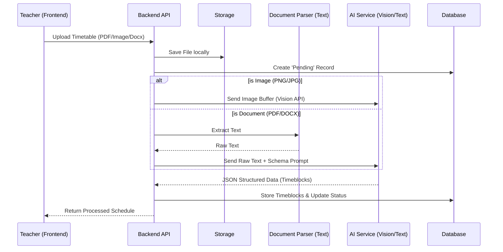
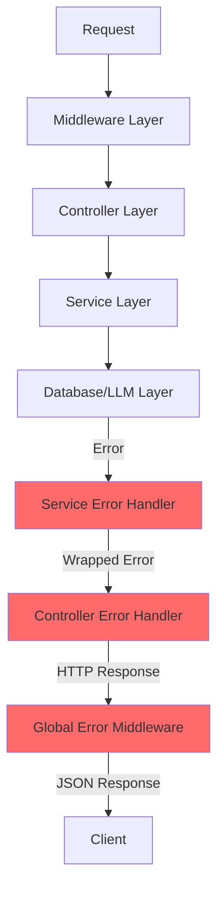
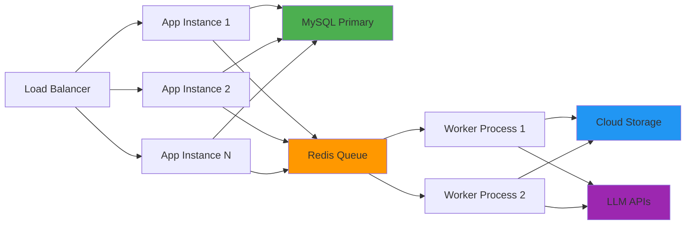

# System Architecture - Learning Yogi Timetable System

## 1. Architectural Design Plan

### End-to-End Workflow

The system follows a linear pipeline optimized for flexibility and accuracy.



### Technology Stack & Rationale

| Component       | Choice                                     | Rationale                                                                                                                                                 |
| --------------- | ------------------------------------------ | --------------------------------------------------------------------------------------------------------------------------------------------------------- |
| **Backend**     | Node.js + Express                          | Non-blocking I/O is ideal for handling concurrent file uploads and long-poll AI requests. Huge ecosystem for valid parsing libraries.                     |
| **Database**    | MySQL                                      | Relational data integrity is crucial for Teacher <-> Timetable relationships. JSON columns allow flexibility for raw metadata.                            |
| **AI / LLM**    | **Google Gemini (Vision)** / OpenAI GPT-4o | **Multimodal capabilities are essential.** Pure OCR fails on color-coded or complex layouts. Vision models "see" the grid structure.                      |
| **OCR/Parsing** | `pdf-parse`, `mammoth`                     | Lightweight local parsing for text-native documents (PDF/Word) reduces cost and latency compared to sending everything to Vision.                         |
| **Frontend**    | Vanilla JS + CSS                           | For this assessment, keeps the build chain simple and "closer to metal" to demonstrate fundamental understanding, but architects for React/Vue migration. |

### Database Schema

#### `timetables`

Stores document metadata and processing state.

- `id`: PK
- `file_type`: Enum (pdf, image, docx)
- `processing_status`: (pending, processing, completed, failed)
- `raw_extracted_text`: Text (backup/debug)
- `strategies_used`: JSON (e.g. `{"vision": true, "ocr": false}`)

#### `timeblocks`

The atomic unit of a schedule.

- `id`: PK
- `timetable_id`: FK
- `day`: Enum (Monday...Sunday)
- `start_time`: Time
- `end_time`: Time
- `event_name`: Varchar
- `meta`: JSON (for color codes, room numbers, confidence scores)

## 2. LLM Integration Strategy

### Hybrid Pipeline (Vision First)

1.  **Image Route**: If the upload is an image, we bypass local OCR. We send the image directly to Gemini 1.5 Pro or GPT-4o.
    - **Prompt Strategy**: "Analyze this timetable image. Identify the grid structure. Extract events for each day. Return JSON."
    - **Why?**: This handles **handwritten** notes and **color-coded** blocks (e.g., "Blue blocks are Maths") which text-only OCR loses completely.
2.  **Document Route**: If PDF/DOCX, we first try extracting text. If text density is low (scanned PDF), we would ideally convert to image (Vision fallback), but for this prototype, we stick to text extraction + LLM inference.

### Reliability

- **Schema Enforcement**: We use "JSON Mode" (OpenAI) or specific schema instructions (Gemini) to ensure strict `JSON` output.
- **Validation Layer**: The `TimetableService` runs a post-processing validation (regex on times, enum check on days) before saving to DB.

## 3. Error Handling & Flexibility

- **Bad Uploads**: File type validation middleware.
- **Ambiguous Data**: If the LLM returns `confidence < 0.7`, we flag the record. Ideally, the frontend would show these in yellow for manual confirmation.
- **Future Proofing**: The `LLMService` is provider-agnostic. We can swap Gemini for Claude or a local Llama model by changing one env var, thanks to the Adapter pattern.

## 4. Frontend Architecture

### Technology & Design Philosophy

The frontend is built with **Vanilla JavaScript, HTML5, and CSS3** to demonstrate fundamental web development mastery without framework overhead. The architecture is designed for easy migration to React/Vue in production.

#### Key Features

- **Glassmorphism Design**: Modern, premium UI with frosted glass effects, gradient backgrounds, and smooth animations
- **Responsive Layout**: Mobile-first design that adapts to all screen sizes
- **Real-time Feedback**: Visual processing indicators, toast notifications, and dynamic status updates
- **Color-Coded Visualization**: Automatic color generation for timeblocks based on event names using HSL color space

#### UI Components

| Component                | Purpose                                        | Implementation                                      |
| ------------------------ | ---------------------------------------------- | --------------------------------------------------- |
| **Upload Zone**          | Drag-and-drop file upload with visual feedback | Native File API with custom styling                 |
| **Provider Selector**    | Dynamic LLM provider selection                 | Populated from `/api/timetables/providers` endpoint |
| **Processing Indicator** | Shows AI processing status                     | CSS animations with spinner and status text         |
| **Timetable Grid**       | Displays extracted schedule by day             | Dynamic DOM generation with flexbox layout          |
| **Toast Notifications**  | Success/error feedback                         | Custom notification system with auto-dismiss        |

#### State Management

```javascript
// Simple state object for application data
const appState = {
  selectedFile: null,
  selectedProvider: "gemini",
  currentTimetable: null,
  isProcessing: false,
};
```

### Pages

1. **index.html** - Upload and extraction interface
2. **view-timetables.html** - Browse all uploaded timetables with statistics

## 5. File Upload & Validation

### Middleware Architecture

The system uses **Multer** for multipart form data handling with custom configuration:

```javascript
// upload.middleware.js
- Storage: Disk storage with unique filename generation
- File Filter: MIME type validation
- Size Limit: 10MB (configurable via MAX_FILE_SIZE env var)
```

### Supported File Types

| Type       | MIME Type                                                                 | Processing Strategy                                       |
| ---------- | ------------------------------------------------------------------------- | --------------------------------------------------------- |
| **PDF**    | `application/pdf`                                                         | Gemini native PDF support (multimodal) or text extraction |
| **DOCX**   | `application/vnd.openxmlformats-officedocument.wordprocessingml.document` | Text extraction via `mammoth` library                     |
| **Images** | `image/png`, `image/jpeg`, `image/jpg`                                    | Direct Vision API processing                              |

### File Processing Pipeline

1. **Upload** → Multer saves to `./uploads` directory with unique name
2. **Validation** → MIME type and size checks
3. **Database Record** → Create timetable record with `pending` status
4. **Document Parsing** → Extract text (if applicable) via `documentParser.service.js`
5. **LLM Processing** → Send to appropriate LLM provider
6. **Validation & Normalization** → Validate extracted data structure
7. **Database Storage** → Save timeblocks and update status to `completed`

## 6. Security & Error Handling

### Security Measures

#### Input Validation

- **File Type Whitelist**: Only PDF, DOCX, PNG, JPG, JPEG allowed
- **File Size Limits**: Maximum 10MB to prevent DoS attacks
- **MIME Type Verification**: Server-side validation, not just extension checking

#### API Security

- **CORS Configuration**: Configurable allowed origins via `ALLOWED_ORIGINS` env var
- **Error Message Sanitization**: No sensitive information leaked in error responses
- **API Key Protection**: LLM API keys stored in environment variables, never exposed to frontend

#### Database Security

- **Prepared Statements**: MySQL2 library uses parameterized queries to prevent SQL injection
- **Foreign Key Constraints**: Cascading deletes maintain referential integrity
- **Input Sanitization**: All user inputs sanitized before database operations

### Error Handling Strategy

#### Layered Error Handling



#### Error Categories

| Category               | HTTP Status | Handling Strategy                      |
| ---------------------- | ----------- | -------------------------------------- |
| **Validation Errors**  | 400         | Return specific validation messages    |
| **Not Found**          | 404         | Return resource-specific error         |
| **LLM Failures**       | 500         | Log details, return generic message    |
| **Database Errors**    | 500         | Log query, return sanitized message    |
| **File Upload Errors** | 400/500     | Clean up partial uploads, return error |

#### Processing Logs

The `processing_logs` table stores detailed debugging information:

- **Log Levels**: `info`, `warning`, `error`
- **Structured Data**: JSON details field for complex error context
- **Timestamped**: Automatic timestamp for debugging timeline
- **Queryable**: Accessible via `/api/timetables/:id/logs` endpoint

## 7. Deployment & Scalability

### Deployment Options

#### Development

```bash
npm run dev  # Nodemon with auto-reload
```

#### Production

```bash
# Option 1: Direct Node.js
npm start

# Option 2: PM2 Process Manager (Recommended)
npm run pm2:start    # Start with PM2
npm run pm2:restart  # Restart
npm run pm2:logs     # View logs
npm run pm2:stop     # Stop
```

### Scalability Considerations

#### Horizontal Scaling

- **Stateless Design**: No session state stored in memory
- **File Storage**: Currently local disk; migrate to S3/Cloud Storage for multi-instance deployments
- **Database Pooling**: MySQL2 connection pooling configured for concurrent requests

#### Performance Optimizations

1. **Async Processing**: Non-blocking I/O for file uploads and LLM requests
2. **Database Indexing**: Indexes on `teacher_id`, `processing_status`, `timetable_id`, `day_of_week`
3. **Computed Columns**: `duration_minutes` calculated at database level
4. **Lazy Loading**: Timeblocks only loaded when specific timetable is requested

#### Bottlenecks & Solutions

| Bottleneck               | Impact                     | Solution                                              |
| ------------------------ | -------------------------- | ----------------------------------------------------- |
| **LLM API Latency**      | 10-30s processing time     | Implement job queue (Bull/Redis) for async processing |
| **File Storage**         | Disk space limitations     | Migrate to cloud storage (S3, GCS)                    |
| **Database Connections** | Connection pool exhaustion | Increase pool size, implement connection retry logic  |
| **Concurrent Uploads**   | Memory usage spikes        | Implement rate limiting, request queuing              |

### Production Recommendations



## 8. Testing Strategy

### Current Test Coverage

The system includes manual testing scripts:

- **tests/test-upload.js** - Automated upload testing with sample files
- **Manual Testing** - Browser-based UI testing

### Recommended Testing Approach

#### Unit Tests

```javascript
// Service Layer Tests
-LLMService.validateAndNormalize() -
  LLMService.isValidTime() -
  DocumentParserService.extractText() -
  TimetableService.createTimetable();
```

#### Integration Tests

```javascript
// API Endpoint Tests
- POST /api/timetables/upload (with various file types)
- GET /api/timetables
- GET /api/timetables/:id
- DELETE /api/timetables/:id
- GET /api/timetables/providers
```

#### End-to-End Tests

```javascript
// Complete Workflows
- Upload PDF → Extract → Verify timeblocks
- Upload Image → Vision processing → Display results
- Upload DOCX → Text extraction → LLM parsing
- Error scenarios (invalid files, LLM failures)
```

### Testing Tools Recommendation

- **Unit Tests**: Jest or Mocha
- **Integration Tests**: Supertest
- **E2E Tests**: Playwright or Cypress
- **Load Testing**: Artillery or k6

## 9. Configuration Management

### Environment Variables

All configuration is externalized via `.env` file:

#### Core Configuration

```env
NODE_ENV=development|production
PORT=3000
SERVER_URL=http://localhost:3000
```

#### Database Configuration

```env
DB_HOST=localhost
DB_USER=root
DB_PASSWORD=your_password
DB_NAME=learning_yogi
```

#### LLM Provider Configuration

```env
DEFAULT_LLM_PROVIDER=gemini|openai|anthropic

# API Keys
OPENAI_API_KEY=sk-...
GEMINI_API_KEY=...
ANTHROPIC_API_KEY=...

# Model Selection
OPENAI_MODEL=gpt-4-turbo-preview
GEMINI_MODEL=gemini-1.5-pro
ANTHROPIC_MODEL=claude-3-opus-20240229
```

#### File Upload Configuration

```env
MAX_FILE_SIZE=10485760  # 10MB in bytes
UPLOAD_DIR=./uploads
```

#### Security Configuration

```env
ALLOWED_ORIGINS=http://localhost:3000,http://localhost:5173
```

### Configuration Best Practices

1. **Never commit `.env`** - Use `.env.example` as template
2. **Validate on startup** - Check required env vars exist
3. **Type conversion** - Parse numbers/booleans from string env vars
4. **Defaults** - Provide sensible defaults for optional configs
5. **Documentation** - Keep `.env.example` up-to-date with all options

## 10. API Design Principles

### RESTful Conventions

- **Resource-based URLs**: `/api/timetables`, `/api/timetables/:id`
- **HTTP Methods**: GET (read), POST (create), DELETE (delete)
- **Status Codes**: 200 (success), 201 (created), 400 (bad request), 404 (not found), 500 (server error)

### Response Format Standardization

```json
// Success
{
  "success": true,
  "data": { ... },
  "message": "Optional message"
}

// Error
{
  "success": false,
  "error": "Error description",
  "status": 400
}
```

### API Versioning Strategy

Currently v1 (implicit). For future versions:

- **URL Versioning**: `/api/v2/timetables`
- **Header Versioning**: `Accept: application/vnd.learningyogi.v2+json`

## 11. Monitoring & Observability

### Logging Strategy

#### Application Logs

- **Console Logging**: Development environment
- **File Logging**: Production (recommend Winston or Pino)
- **Structured Logging**: JSON format for parsing

#### Database Logs

- **Processing Logs Table**: Stores timetable processing events
- **Query Logs**: MySQL slow query log for optimization

### Recommended Monitoring

1. **Application Performance Monitoring (APM)**: New Relic, DataDog
2. **Error Tracking**: Sentry
3. **Uptime Monitoring**: UptimeRobot, Pingdom
4. **Log Aggregation**: ELK Stack, Splunk

### Key Metrics to Track

- **Request Rate**: Requests per second
- **Response Time**: P50, P95, P99 latencies
- **Error Rate**: 4xx and 5xx responses
- **LLM Processing Time**: Time spent in LLM API calls
- **Database Query Time**: Slow query detection
- **File Upload Success Rate**: Upload failures vs successes
